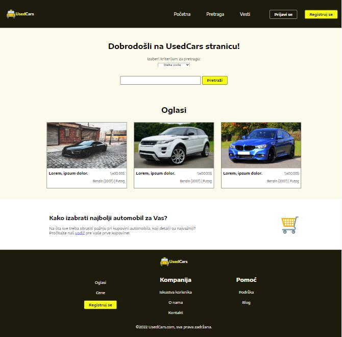
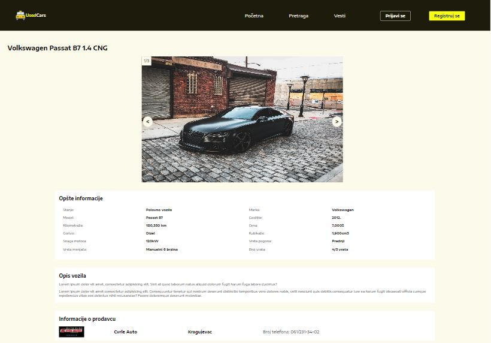
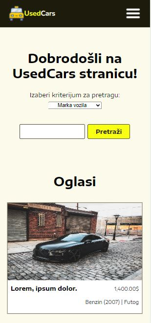

# Used Cars Website - College project

Frontend part of one of college group projects, done by me with HTML, CSS and JavaScript. It contains several pages, including homepage with some placeholder ads, registration page, profile page for logged users, single ad page with all the detailed information, and a few more. It's a template that was later upgraded to a full-stack application with all the necessary functionalities, made in Laravel.

## Table of contents

- [Overview](#overview)
  - [Screenshot](#screenshot)
- [Process](#process)
  - [Built with](#built-with)
  - [How to access website pages](#how-to-access-website-pages)
- [Author](#author)

## Overview

Users should be able to:
- see the homepage and open a login modal
- go to the register page
- see detailed info of an car advert and a user that published it
- see the template for the profile page
- go to the adding ad page and see the form

### Screenshot

Screenshots of homepage and profile page, as well as mobile design:

## Process

### Built with

- Semantic HTML5 markup
- Flexbox
- CSS Grid
- JavaScript
- Mobile-first workflow

### How to access website pages

- Download the source code and extract it somewhere on your machine
- Open the project in Visual Studio Code
- Install Live Server extension
- Open index.html and start the server
- Some pages are not accessible from the homepage; change the URL with a filename that you want to see (e.g. http://127.0.0.1:5500/index.html -> http://127.0.0.1:5500/profile.html)

## Author

- GitHub - [https://github.com/jelenkoo10](https://github.com/jelenkoo10)
- Frontend Mentor - [@jelenkoo10](https://www.frontendmentor.io/profile/jelenkoo10)
- LinkedIn - [Veljko Jelenković](https://www.linkedin.com/in/veljko-jelenkovi%C4%87-182981250/)
